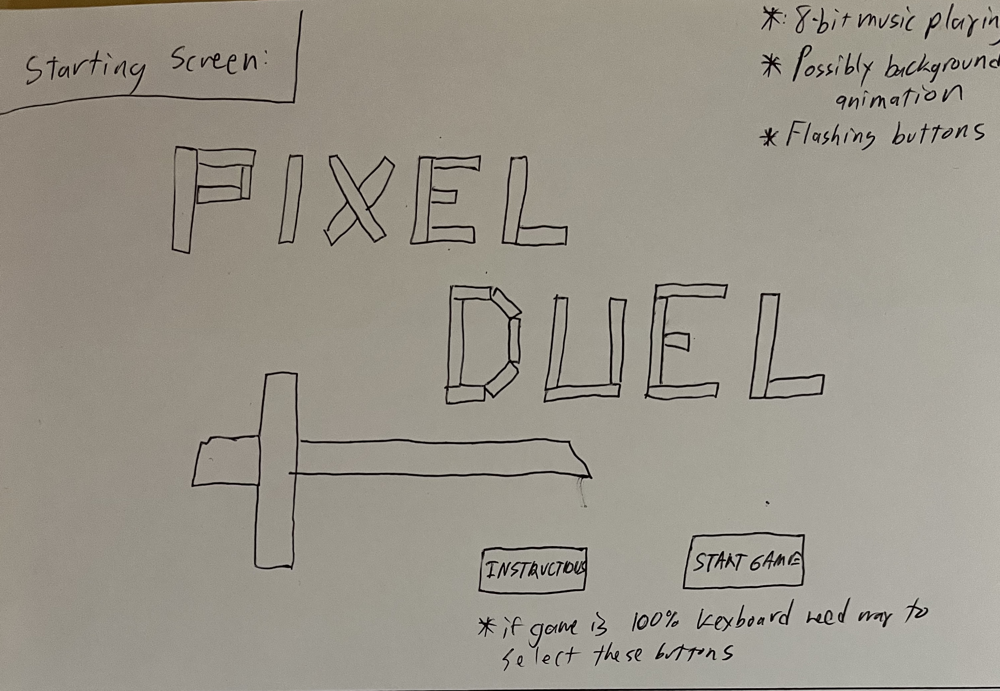
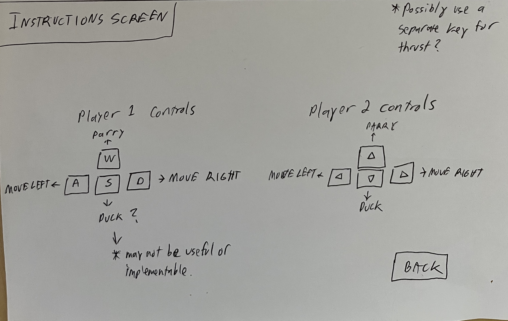
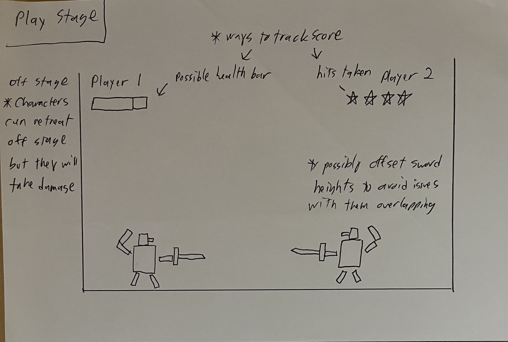
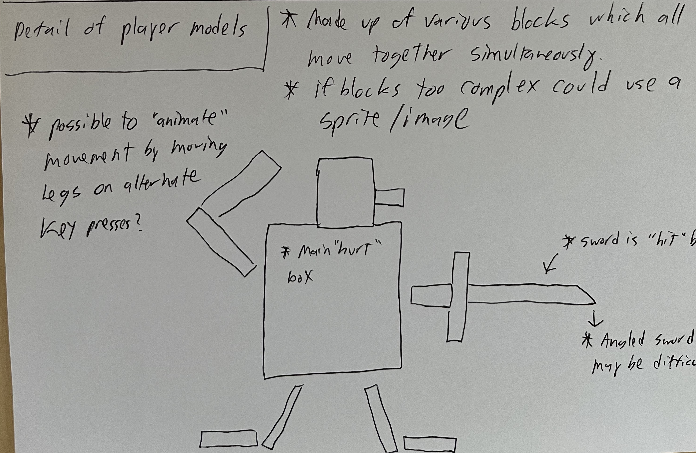
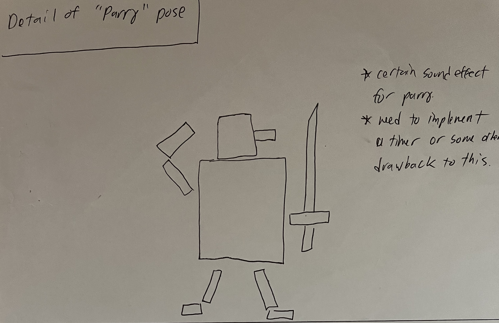
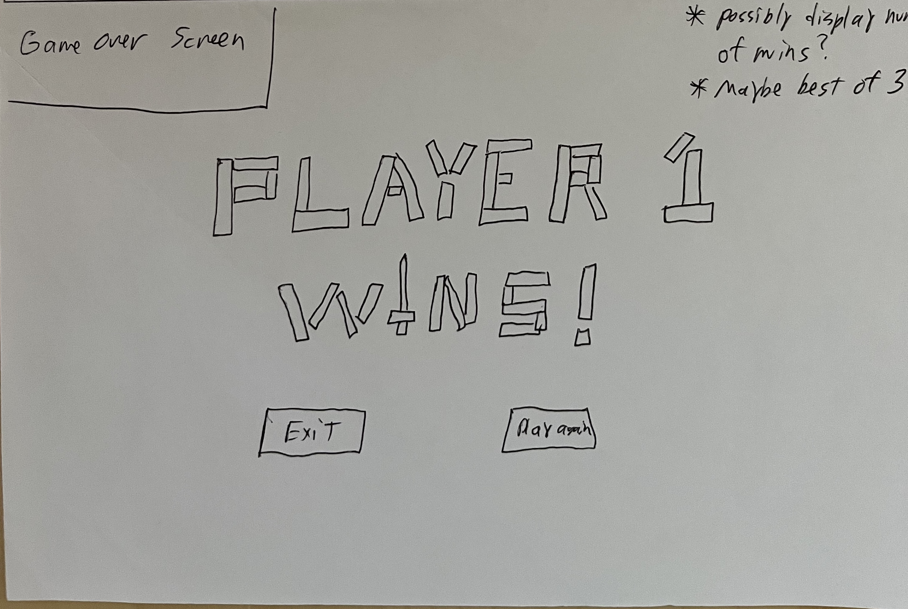

# Pixel Duel

## Overview
---

Pixel duel is a lo-fi fencing game created as an homage to old freeware games of the early DOS gaming era.  It features a simultaneous 2 player VS mode played side by side on a single keyboard.  The gameplay is enhanced by an 8-bit inspired sountrack and synthesized sound effects.  Duel it out with a friend to see who is the champion!

---

## User Stories

    As a user, I want the ability to choose my character color
    As a user, I want the ability to control my character in a responsive way
    As a user, I want the ability to see my remaining health indicated
    As a user, I want the ability to see how many wins or loses I have
    As a user, I want the ability to select different backgrounds/stages
    As a user, I want the ability to select different music tracks
    As a user, I want the ability to absolutely crush my opponent!

---

## Wireframes
---

